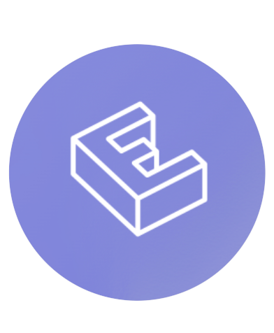
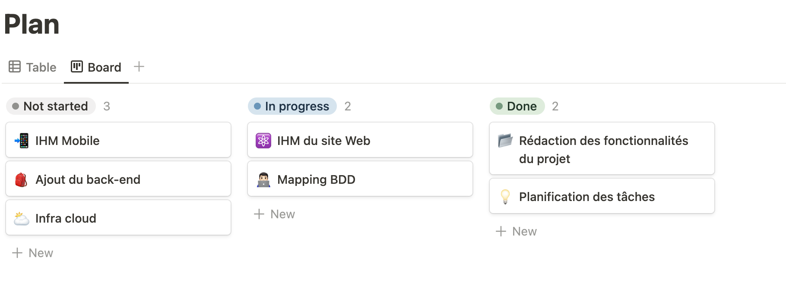
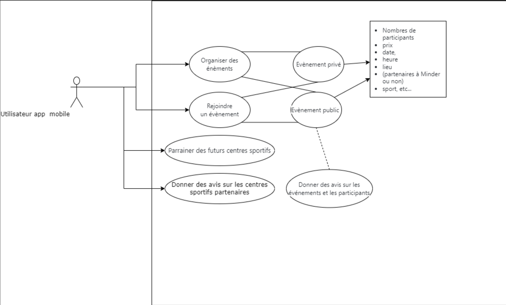

# Minder

Minder est un projet communautaire dans l'organisation d'événements sportif, de tout types

## Contexte

De nos jours, nous avons du mal à organisé des événements sportifs, que ce soit pour trouver des participants ou pour trouver un lieu. Nous avons donc décidé de créer un site web et une application mobile qui permettra de faciliter la recherche de participants et de lieux pour organiser des événements sportifs. Nous avons également décidé de créer un système de parrainage pour les centres sportifs qui souhaitent rejoindre notre site web, qui pourront atteindre plus facilement notre communauté.

## Livrable

Le but de ce projet est d'avoir  :

- Un site web comportant :
  - Une page d'accueil servant de vitrine où l'on pourra avoir une carte des centres sportifs partenaires du site
  - Une partie dédié pour les centre sportifs partenaires qui veulent souscrire à notre site web
- Une application mobile pour les utilisateurs, ils pourront :
  - Organiser des énements (public ou privé) -> Nombres de participants, prix, date, heure, lieu (partenaires à Minder ou non), sport, etc...
  - Rejoindre des événements
  - Donner des avis sur les événements et les participants (si l'événement est public)
  - Donner des avis sur les centres sportifs partenaires
  - Parainner des futurs centres sportifs
- Une API qui récupère différentes informations :
  - Les centres sportifs
  - Les évènements publics
  - Utilisateurs (pour l'application mobile)

## Technologies

Le site web sera en **React** et l'application mobile en **Flutter Dart**. L'API sera en **NodeJS**. Le stockage des données sera sur **MongoDB**, tous cela dans un environnement cloud **GCP**. Les planifications des tâches seront gérées par **Notion**.

## Planning du projet

## Répartition des tâches

| Tâche | Responsable(s) | Avancement |
| --- | --- | --- |
| 📂 Rédaction des foncionnalités du projet | Zakaria, Youssef, Nicolas | Terminé |
| 💡 Plannification des tâches | Tous | Terminé |
| ⚛️ IHM du site web | Nicolas, Youssef | Développement |
| 🧑🏻‍💻 Mapping BDD | Zakaria, Yanis | Développement |
| 📲 IHM de l'application mobile | Zakaria, Youssef | Pas commencé |
| 🎒 Ajout du back-end | Nicolas, Yanis | Pas commencé |
| ⛅️ Infrastructure cloud | Yanis, Youssef, Zakaria, Nicolas | Pas commencé |

## Outils d'avancement

- **Notion** : Planification des tâches principales
- **Github** : Planification des tâches spécifique en fonction des projets (site web, application mobile, back, etc...)

## Uses cases

## Méthodologie de delivery

Nous avons décidé de travailler en **Scrum**. Les sprints seront définis à chaque créneau de projet transverse, dans le sens où on mettra en place des milestones **Github** qui aura pour deadline le prochain créneau de projet transverse. Des réunions seront organisées à chaque début de sprint pour définir les tâches à réaliser et les tâches terminées, mais aussi des réunions hebdomadaire seront mises en place pour ne pas faire trainé des choses. Les réunions seront organisées sur **Discord**.

## Equipe

Nom de l'équipe : **Projet Inverse**
Composition : **4 personnes**

- **Zakaria TOBBAL** : Chef de projet, développeur back-end API, mobile
- **Youssef OUAZZANI** : Développeur front-end, mobile, back-end
- **Nicolas BATAILLARD** : Développeur front-end, mobile
- **Yanis AMRAOUI** : Développeur front-end, mobile, infrastructure cloud
