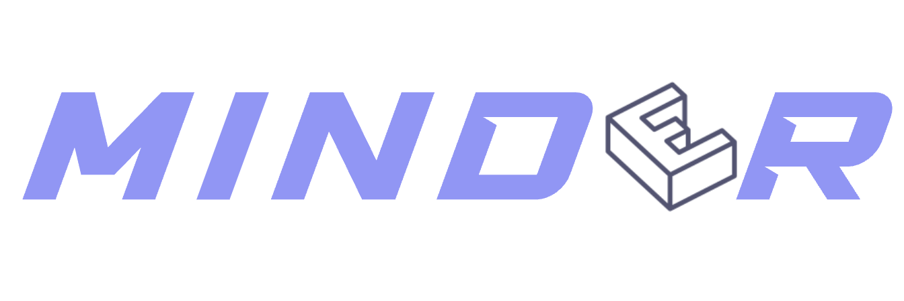
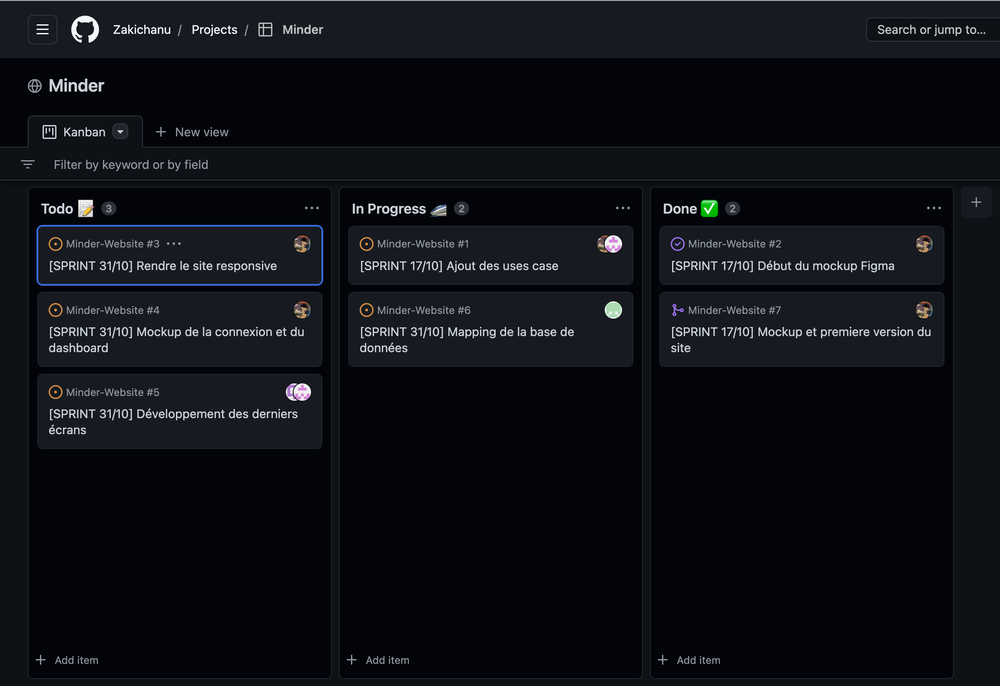

# 

Minder est un projet communautaire dans l'organisation d'événements sportif, de tout types

## Contexte

De nos jours, nous avons du mal à organiser des événements sportifs, que ce soit pour trouver des participants ou pour trouver un lieu pour pratiquer.
Nous avons donc décidé de créer un site web et une application mobile qui permettra de faciliter la recherche de participants et de lieux pour organiser des événements sportifs. Nous avons également décidé de créer un système de parrainage pour les centres sportifs qui souhaitent rejoindre notre site web, qui pourront atteindre plus facilement notre communauté.

## Livrable

Le but de ce projet est d'avoir  :

- Un site web comportant :
  - Une page d'accueil servant de vitrine où les utilisateurs seront invités à installer les applications mobiles.
  - Une partie dédié pour les centre sportifs partenaires :
    - Ils pourront remplir notre formulaire de partenariat, où nous validerons manuellement dans les délais les plus brefs (pour éviter des partenariats hasardeux)
    - Connexion pour les partenaires, mettre en place les prix de leurs activités et les horaires d'ouverture et de fermeture.
    - Les centres sportifs pourront organiser des tournois, events, etc... en partenariat avec Minder
- Une application mobile pour les utilisateurs, ils pourront :
  - Organiser des évènements (public ou privé) -> Nombres de participants, prix, date, heure, lieu (partenaires à Minder ou non), sport, etc...
  - Rejoindre des événements
  - Donner des avis sur les événements et les participants (système de note sur le niveau de la personne, et pourquoi pas mettre des récompenses sur le profil de la personne)
  - Donner des avis sur les centres sportifs
  - (Parainner des futurs centres sportifs)
- Une API qui récupère différentes informations :
  - Les centres sportifs
  - Les évènements publics
  - Utilisateurs (pour l'application mobile)
  - Et toute sortes d'autres informations utiles

> NB : Un système de mini-réduction pour les utilisateurs qui organisent un événement sera mis en place, pour les inciter à organiser des événements.

## Technologies

Le site web sera en **React** et l'application mobile en **Flutter Dart**. L'API sera en **NodeJS**. Le stockage des données sera sur **MySQL**, tous cela dans un environnement cloud **GCP**. Les planifications des tâches seront gérées par **Notion** et **GitHub Project**.

## Outils d'avancement

- **Notion** : Planification des tâches principales
- **GitHub** : Planification des tâches spécifique en fonction des projets (site web, application mobile, back, etc...)

## Planning du projet

- Plan général du projet à travers notre page [**Notion**](https://melodic-belt-5d6.notion.site/Minder-6959df9cff8348298d99615a1df31f6f) : 
- Plan détaillé sur **GitHub Projects** : 
- Liste des choses à faire selon le projet (exemple avec Minder-Website) : 
## Répartition des tâches

| Tâche | Responsable(s) | Avancement |
| --- | --- | --- |
| 📂 Rédaction des foncionnalités du projet | Zakaria, Youssef, Nicolas | Terminé |
| 💡 Plannification des tâches | Tous | Terminé |
| ⚛️ IHM du site web | Nicolas, Youssef | Développement |
| 🧑🏻‍💻 Mapping BDD | Zakaria, Yanis | Développement |
| 📲 IHM de l'application mobile | Zakaria, Youssef | Pas commencé |
| 🎒 Ajout du back-end | Nicolas, Yanis | Pas commencé |
| ⛅️ Infrastructure cloud | Yanis, Youssef, Zakaria, Nicolas | Pas commencé |

## Use cases

Un diagramme de cas d'utilisation qui résume ce qu'on veut faire :

## Méthodologie de delivery

Nous avons décidé de travailler en **Scrum**. Les sprints seront définis à chaque deux semaines, à travers des milestones **GitHub**. Des réunions seront organisées à chaque début de sprint pour définir les tâches à réaliser et les tâches terminées, mais aussi des réunions hebdomadaire seront mises en place pour ne pas faire trainé des choses. Les réunions seront organisées sur **Discord**.

## Equipe

Nom de l'équipe : **Projet Inverse**
 
Composition : **4 personnes**

- **Zakaria TOBBAL** : Chef de projet, développeur back-end API, mobile, front-end
- **Youssef OUAZZANI** : Développeur front-end, mobile, back-end
- **Nicolas BATAILLARD** : Développeur front-end, mobile, infrastructure cloud
- **Yanis AMRAOUI** : Développeur back-end, mobile, infrastructure cloud
